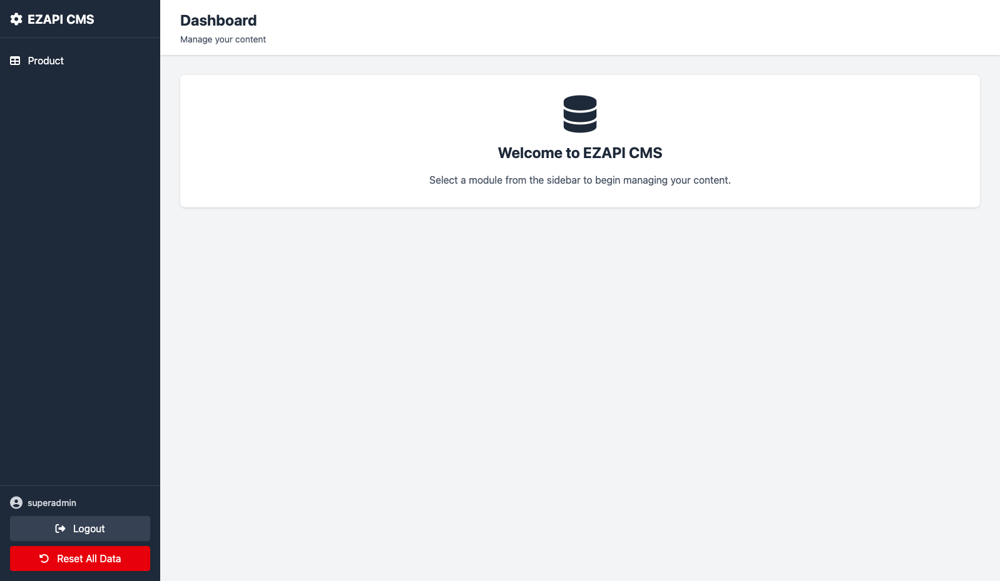
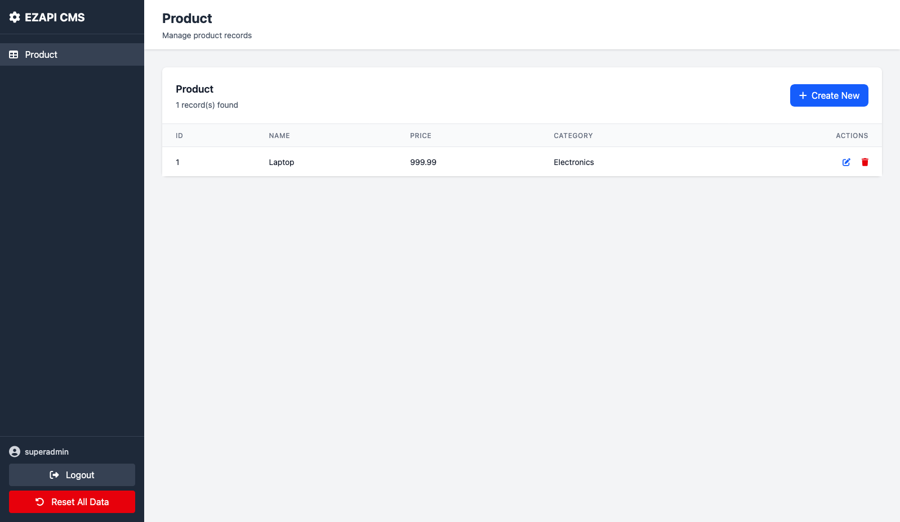

# Ezapi Golang Version

Similar to this repo [ezapi](https://github.com/Minicode-HK/ezapi)

Build a simple RESTful API with `type` and `data`. The API does not require a database and provides endpoints for basic CRUD operations. All the data is stored in runtime memory.

Anytime you restart the server, the data will be reset. This is a good tool for testing and prototyping.

## Features

- Auto-generated CRUD endpoints with `RegisterRouter`
- Custom API endpoints with `RegisterRouterWith`  
- Automatic route registration
- Generic handlers with reflection
- Built-in CMS Admin Panel - auto-generate admin UI for data management. Full CRUD support & form field type detection.

## TODO
- Password should be hashed
- Mutex support for concurrent access
- Snapshot and versioning
- Pagination support
- Schema reload

## Quick Start

### `RegisterRouter` - Auto CRUD
For standard REST APIs with full CRUD operations:

```golang
func init() {
    RegisterRouter(&YourDB, "/api/endpoint")
}
```

**Generates:**
- `GET /api/endpoint` - List all
- `GET /api/endpoint/:id` - Get by ID
- `POST /api/endpoint` - Create
- `PUT /api/endpoint/:id` - Update  
- `DELETE /api/endpoint/:id` - Delete

### `RegisterRouterWith` - Custom Routes
For custom endpoints, authentication, or special logic:

```golang
func init() {
    RegisterRouterWith(func(router *gin.Engine) {
        router.POST("/api/login", loginHandler)
        router.GET("/api/stats", statsHandler)
        // Any custom routes you need
    })
}
```

### `ResetableDatabase` - In-Memory DB
To create an in-memory database that able to reset:

```golang
var YourDB = ResetableDatabase(&YourDB, []YourType{
    { ... initial data ... },
})
```

And the data will be reset when `/api/reset` is called.

### `init` Function
The `init` function is called automatically when the package is imported. You can use it to register your routes.

### Example

```golang
package route

import (
    "strings"
    
    "github.com/gin-gonic/gin"
)

type Product struct {
    Id          string  `json:"id"`
    Name        string  `json:"name" binding:"required"`
    Price       float64 `json:"price" binding:"required,gt=0"`
    Category    string  `json:"category"`
    InStock     bool    `json:"in_stock"`
}

var ProductDB []Product 

func GetProductDB() *[]Product {
    return &ProductDB
}

func init() {
    // Initialize the in-memory database
    ProductDB = ResetableDatabase(&ProductDB, []Product{
        {Id: "1", Name: "Laptop", Price: 999.99, Category: "Electronics", InStock: true},
    })

    // Standard CRUD operations
    RegisterRouter(&ProductDB, "/api/products")
    
    // Custom endpoints
    RegisterRouterWith(func(router *gin.Engine) {
        // Get products by category
        router.GET("/api/products/category/:category", func(c *gin.Context) {
            category := c.Param("category")
            var filtered []Product
            
            for _, product := range ProductDB {
                if product.Category == category {
                    filtered = append(filtered, product)
                }
            }
            
            SendSuccess(c, filtered)
        })
        
        // Search products
        router.GET("/api/products/search", func(c *gin.Context) {
            query := c.Query("q")
            var results []Product 
            
            for _, product := range ProductDB {
                if strings.Contains(strings.ToLower(product.Name), strings.ToLower(query)) {
                    results = append(results, product)
                }
            }
            
            SendSuccess(c, results)
        })
    })
}
```

This gives you:
- **CRUD routes**: `/api/products`, `/api/products/:id` etc.
- **Custom routes**: `/api/products/category/:category`, `/api/products/search`
- **CMS interface**: Manage products through web UI at `/cms/admin`

## CMS Admin Panel

### Setup CMS
1. **Register your data models:** in cms/main.go
```golang
// Register your models here
// Leave empty to include *ALL* models automatically
var Modules = []interface{}{
    route.Product{},
    // Add more models as needed
}
```

2. **Register CMS routes in your main.go:**

```golang
// Register CMS routes
cms.RegisterCMSRoutes(router)
```

3. **Access the CMS:**
   - Login page: `http://localhost:8080/cms/login`
   - Admin panel: `http://localhost:8080/cms/admin` (requires login)

   - Username: `superadmin`, Password: `superadmin`
   - You can change credentials in `cms/main.go`


### Supported Field Types

The CMS automatically detects field types from your Go structs:

**Type mappings:**
- `string` → Text input
- `int`, `float64` → Number input
- `bool` → Checkbox
- `time.Time` → DateTime picker
- Fields containing "json" in name → JSON textarea
- Arrays/Maps → JSON textarea


## Response Format

All responses follow this format:

### Success Response
```json
{
    "success": true,
    "data": { ... }
}
```

### Error Response  
```json
{
    "success": false,
    "message": "Error description"
}
```

### Validation Error Response
```json
{
    "success": false,
    "message": "Validation failed",
    "details": ["Name is required", "Price must be greater than 0"]
}
```

## Screenshots


### Admin Dashboard




