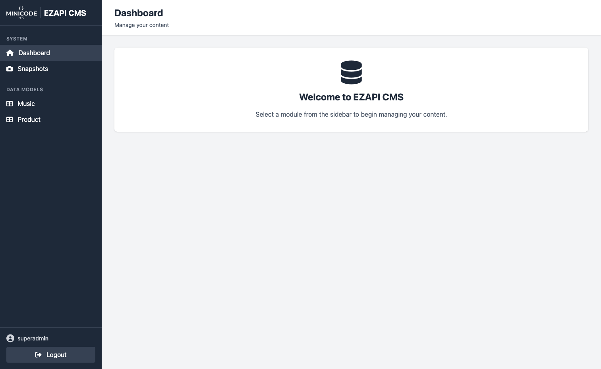
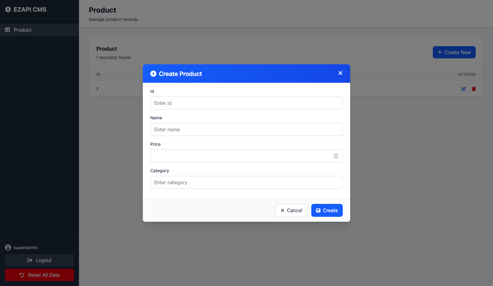

# EZAPI-GO - Zero-Setup REST API for Prototyping



> Build and test REST APIs in minutes, not hours. No database, no configuration, just pure Go.

```bash
# Just clone and run
go run main.go
```

---

## What Problem Does This Solve?

**Before EZAPI-GO:**
```bash
# Want to test a REST API idea?
1. Setting MySQL connection (10 min)
2. Write migrations (15 min)
3. Set up ORM framework (20 min)
4. Write CRUD handlers (45 min)
5. Finally start coding your actual feature...
```

**With EZAPI-GO:**
```go
type Product struct {
    Id    string  `json:"id"`
    Name  string  `json:"name" binding:"required"`
    Price float64 `json:"price" binding:"required,gt=0"`
}

var ProductDB []Product

func init() {
    RegisterRouter(&ProductDB, "/api/products")
}
// Done. You now have 5 endpoints + admin UI.
```

---

## Quick Start (2 Minutes)

### 1. Define Your Data Model

```go
// route/product.go
package route

type Product struct {
    Id       string  `json:"id"`
    Name     string  `json:"name" binding:"required"`
    Price    float64 `json:"price" binding:"required,gt=0"`
    Category string  `json:"category"`
    InStock  bool    `json:"in_stock"`
}

var ProductDB []Product
```

### 2. Register Routes

```go
func init() {
    // Add some initial data
    ProductDB = ResetableDatabase(&ProductDB, []Product{
        {Id: "1", Name: "Laptop", Price: 999.99, Category: "Electronics", InStock: true},
        {Id: "2", Name: "Mouse", Price: 29.99, Category: "Electronics", InStock: true},
    })

    // This single line creates 5 REST endpoints
    RegisterRouter(&ProductDB, "/api/products")
}
```

### 3. Start Server

```go
// main.go
package main

import (
    "github.com/gin-gonic/gin"
    "simple_backend_go/route" // Auto-registers routes
    "simple_backend_go/cms"
)

func main() {
    router := gin.Default()
    // Setup all registered API routes
    route.SetupAllRouters(router)

    // Setup CMS admin panel
    // comment this line if you don't want admin UI
    cms.RegisterCMSRoutes(router)

    router.Run(":8080")
}
```

### 4. Everything is Ready!

## Core Concepts

### 1. `RegisterRouter` - Auto CRUD

One line creates **RESTful endpoints**:

```go
RegisterRouter(&ProductDB, "/api/products")
```

**Generates:**
| Method | Endpoint | Description |
|--------|----------|-------------|
| `GET` | `/api/products` | List all products |
| `GET` | `/api/products/:id` | Get product by ID |
| `POST` | `/api/products` | Create new product |
| `PUT` | `/api/products/:id` | Update product |
| `DELETE` | `/api/products/:id` | Delete product |

### 2. `ResetableDatabase` - Predictable State

```go
ProductDB = ResetableDatabase(&ProductDB, []Product{
    {Id: "1", Name: "Laptop", Price: 999.99},
})
```


### 3. `RegisterRouterWith` - Custom Logic

Need custom endpoints? Add them alongside auto-generated ones:

```go
func init() {
    // Auto-generated CRUD
    RegisterRouter(&ProductDB, "/api/products")
    
    // Custom endpoints
    RegisterRouterWith(func(router *gin.Engine) {
        // Search products
        router.GET("/api/products/search", func(c *gin.Context) {
            query := c.Query("q")
            var results []Product
            
            for _, product := range ProductDB {
                if strings.Contains(
                    strings.ToLower(product.Name), 
                    strings.ToLower(query),
                ) {
                    results = append(results, product)
                }
            }
            
            SendSuccess(c, results)
        })
        
        // Get by category
        router.GET("/api/products/category/:category", func(c *gin.Context) {
            category := c.Param("category")
            var filtered []Product
            
            for _, p := range ProductDB {
                if p.Category == category {
                    filtered = append(filtered, p)
                }
            }
            
            SendSuccess(c, filtered)
        })
    })
}
```

**Now you have:**
- `GET /api/products` (auto)
- `GET /api/products/:id` (auto)
- `GET /api/products/search?q=laptop` (custom)
- `GET /api/products/category/electronics` (custom)
- Plus POST, PUT, DELETE (auto)

---

## Built-in Admin Panel

Every model you register **automatically gets an admin interface**:

### Setup (30 seconds)

```go
// cms/main.go

var Modules = []interface{}{
    // Leave empty to auto-discover ALL models
    route.Product{},
}
```

```go
// main.go
cms.RegisterCMSRoutes(router)
```

**Access:**
- Login: `http://localhost:8080/cms/login`
- Dashboard: `http://localhost:8080/cms/admin`

**Default credentials:**
- Username: `superadmin`
- Password: `superadmin`

### What You Get

The CMS automatically generates:

- **List View** - See all records in a table
- **Create Form** - Smart inputs based on field types
- **Edit Form** - Pre-filled with existing data
- **Delete** - With confirmation dialog

**Field Type Mapping:**

| Go Type | Form Input | Example |
|---------|------------|---------|
| `string` | Text input | `<input type="text">` |
| `int`, `float64` | Number input | `<input type="number">` |
| `bool` | Checkbox | `<input type="checkbox">` |
| `time.Time` | DateTime picker | `<input type="datetime-local">` |
| Field name contains `json` | JSON textarea | Syntax highlighted editor |
| `[]string`, `map[string]any` | JSON textarea | Multi-line editor |


### Example Forms


---

## API Response Format

All endpoints return consistent JSON:

### Success Response
```json
{
    "success": true,
    "data": { ... }
}
```

### Error Response
```json
{
    "success": false,
    "message": "Product not found"
}
```

### ⚠️ Validation Error
```json
{
    "success": false,
    "message": "Validation failed",
    "details": [
        "Name is required",
        "Price must be greater than 0"
    ]
}
```

---

## TODO 

- [ ] **Security:** Hash passwords with bcrypt
- [ ] **Concurrency:** Add mutex for thread-safe operations
- [ ] **Persistence:** Optional JSON snapshot save/load
- [ ] **Pagination:** Support for large datasets
- [ ] **Filtering:** Query parameter filters
- [ ] **Sorting:** Sort by any field
- [ ] **Relationships:** Link between models in CMS
- [ ] **File Upload:** Handle multipart forms